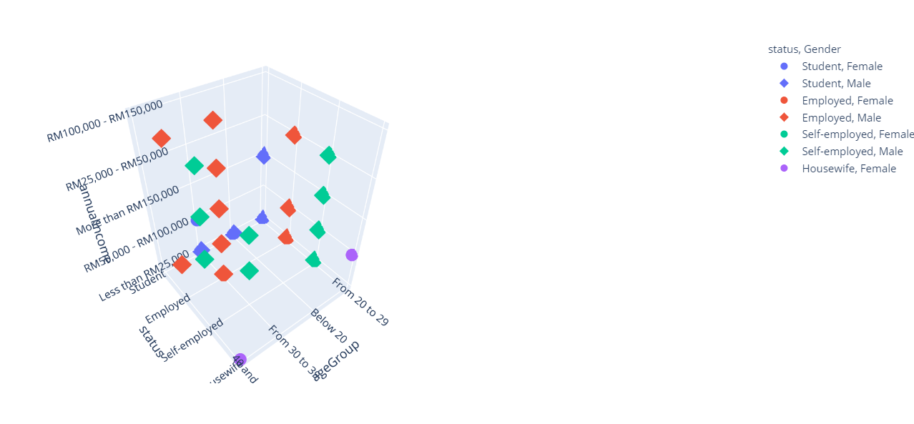
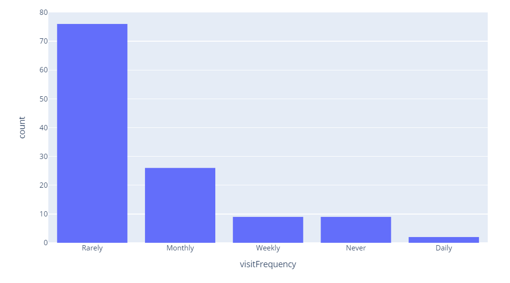
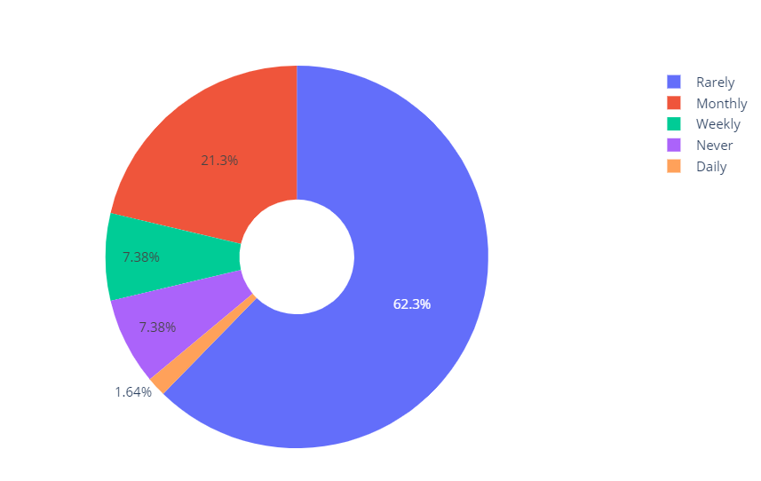
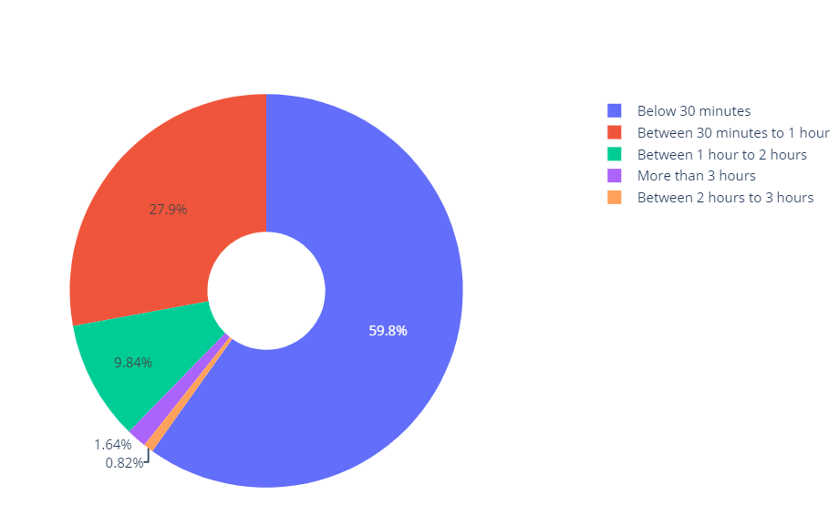
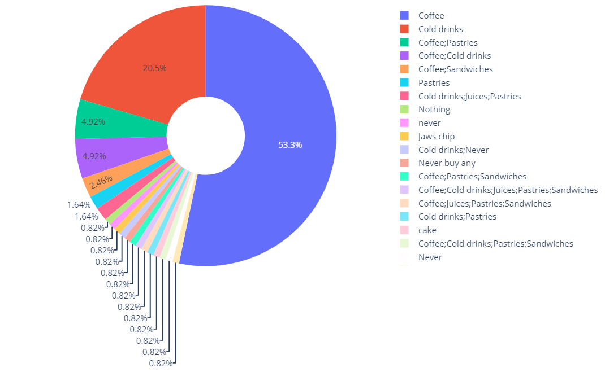
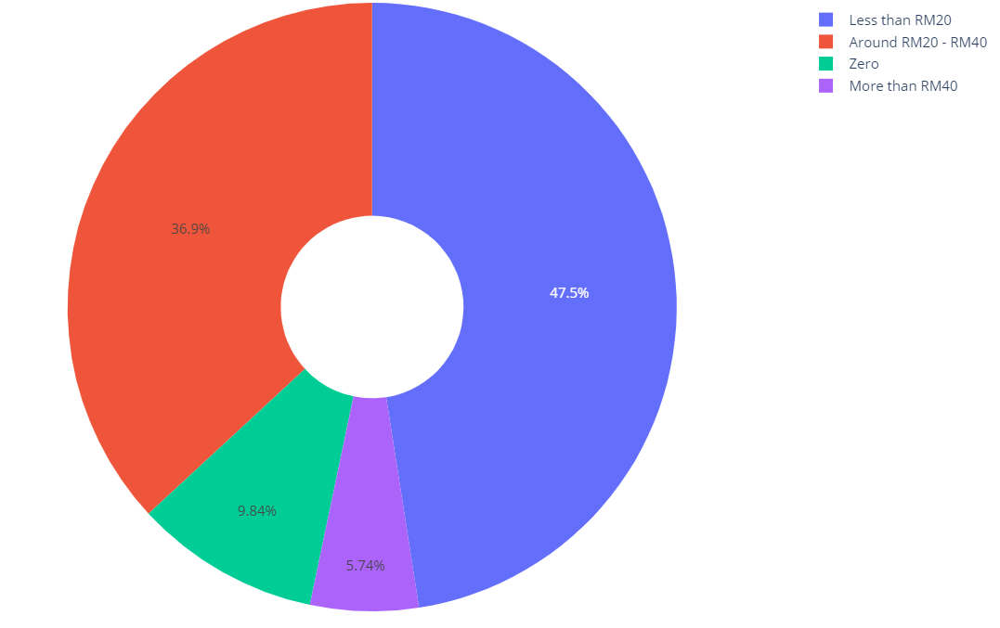
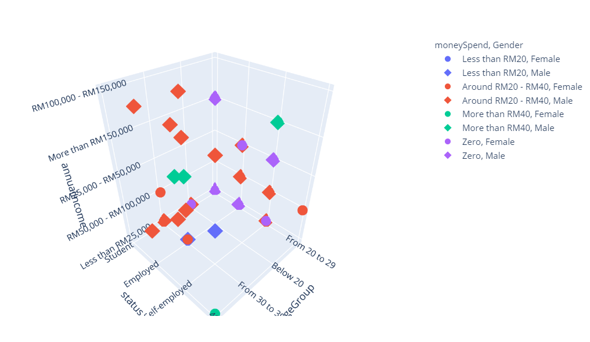

# Customer-Buying-behavior

Customer spending and satisfaction survey in starbucks
Refer to the jupyter notebook for detailed analysis

# Components of the customers

# Visiting Frequency

# Time spending in Starbucks of each Customers

# Product sales analysis

# Money spend

# Components of customers & moneySpend

